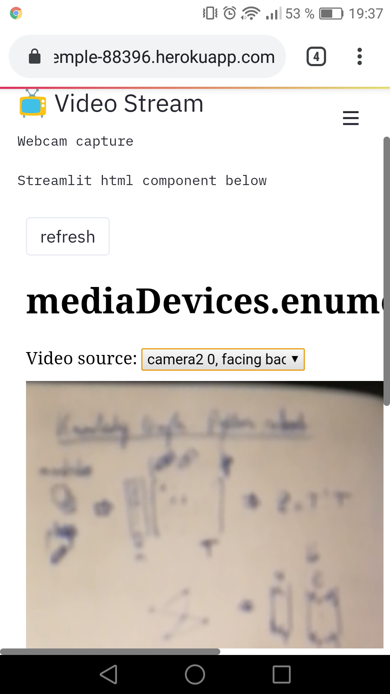

# Cam App

Streamlit version https://glacial-temple-88396.herokuapp.com/
Run Offline:
```
cd streamlit-app
streamlit run webcam.py
```



## Inspiration:

### Streamlit:
- https://github.com/lukexyz/iris
- https://discuss.streamlit.io/t/webcam-html-component/6366
- https://github.com/lukexyz/iris/blob/main/webcam.py
- https://discuss.streamlit.io/t/possible-to-access-webcam-realtime-in-a-streamlit-app/947/5

### Flask:
- https://dev.to/carlosemv/dockerizing-a-flask-based-web-camera-application-469m
- https://github.com/carlosemv/camera-app
- https://www.flaskpwa.com/#_hardwareCamera

### JavaScript:
- https://blog.prototypr.io/make-a-camera-web-app-tutorial-part-1-ec284af8dddf
- https://github.com/abenjamin765/camera-app/tree/master/part-2

### getUserMedia()/imageCapture():
- https://developer.mozilla.org/en-US/docs/Web/API/WebRTC_API/Taking_still_photos
- https://github.com/mdn/samples-server/blob/master/s/webrtc-capturestill/capture.js
- https://simpl.info/getusermedia/sources/
- https://github.com/samdutton/simpl/tree/gh-pages/getusermedia/sources
- https://simpl.info/imagecapture/
- https://github.com/samdutton/simpl/tree/gh-pages/imagecapture
- https://stackoverflow.com/questions/46882550/how-to-save-a-jpg-image-video-captured-with-webcam-in-the-local-hard-drive-with
- http://danml.com/download.html

### Webcam-easy:
- https://nodei.co/npm/webcam-easy/
- https://bensonruan.com/how-to-access-webcam-and-take-photo-with-javascript/
- https://medium.com/swlh/how-to-access-webcam-and-take-picture-with-javascript-b9116a983d78

## Deployment on Heroku:
- https://realpython.com/flask-by-example-part-1-project-setup/
